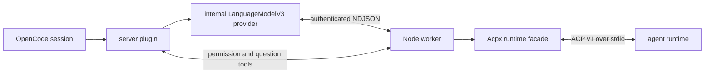

# Architecture

`opencode-acpx` turns each configured ACP agent into an OpenCode provider while
keeping the ACP agent's stateful semantics intact. The integration is contained
in this package; OpenCode and Acpx do not need patches.

## Runtime path

The server entrypoint injects a provider named `acp.<server-id>` through
OpenCode's supported `config` hook. That provider points at the package's own
`provider.js` using a `file://` URL. OpenCode therefore installs one plugin
package and still uses its ordinary provider and model pipeline.

OpenCode caches language-model objects. The model object consequently contains
no conversation state. `chat.params` attaches the OpenCode session, user
message, worktree, plugin instance and selected ACP server to each call. The
provider resolves those values against a process-local registry and routes the
turn to the worker.

## Why the worker exists

OpenCode plugins run under Bun. Acpx 0.13.0 supports Node 22.13 and newer and
uses Node child-process behaviour. A dedicated Node worker:

- keeps Acpx on its supported runtime;
- isolates credentials and ACP child processes from the plugin host;
- owns persistent handles and per-session queues;
- gives provider and interaction-tool calls one authenticated local endpoint;
- ensures stdout from each ACP child remains protocol-only;
- closes owned handles on plugin disposal or parent death.

The current transport is a private child-process stdin/stdout channel with one
JSON object per line. Every frame includes a random 256-bit token, protocol
version and request identifier. Frame size, method parameters and response
shape are validated before dispatch. Stderr is diagnostics-only.

## Session identity and ordering

An ACP agent owns a model loop, tools and history. It is not a stateless text
completion endpoint. A session key includes:

- the state schema version;
- configured server fingerprint;
- authentication profile;
- canonical worktree;
- OpenCode session identifier;
- branch generation.

Executable, arguments, MCP definitions, system-prompt policy and forwarded
environment-variable names are part of the server fingerprint. Model choice is
kept outside the identity where the agent supports in-place model changes.

Each ACP session has one FIFO queue covering model/config changes and prompts.
Different sessions may run concurrently. Cursor uses the stricter default of
one process per session because current Cursor model and repository services
have process-global state.

The binding ledger durably records the OpenCode-to-ACP session identity and
selected model/configuration. While the plugin process is alive, a bounded
in-memory turn hub lets duplicate provider calls join or replay the same ACP
turn. Acpx owns persistent ACP history and restores it after process restart.
The ledger contains tested receipt primitives for a future durable replay path,
but the provider does not yet use those receipts to replay translated stream
parts after a complete plugin restart.

## Segmented turns

ACP can block inside one `session/prompt` while waiting for permission or user
input. OpenCode's provider loop expects host interactions to be ordinary tool
calls. The provider therefore segments one ACP turn:

1. stream ACP text, thought and remote tool activity;
2. when the worker emits an interaction, emit a reserved OpenCode tool call and
   finish that stream segment with `tool-calls`;
3. allow OpenCode to execute the plugin tool and display its native UI;
4. return the answer to the worker out of band;
5. attach the next provider call to the still-running ACP turn at its saved
   event cursor;
6. emit the final `finish` only when ACP completes.

ACP-native tool calls are marked `providerExecuted: true`; OpenCode renders but
does not execute them. A shared projector maps ACP `execute`, `read`, `search`,
`edit` and `fetch` events onto native OpenCode presentation contracts while
retaining ACP status, locations, raw input/output and content as provider
metadata. Unknown shapes keep a namespaced generic tool name. Reserved
interaction calls are host-executed and use unguessable, expiring tokens bound
to the OpenCode and ACP sessions.

Subagent activity follows the same rule. Standard task-shaped calls cover
Claude, Codex and compatible agents. Cursor's session-less `cursor/task`
notification is correlated back to the active turn by its ACP tool-call ID;
Grok's spawn/progress/finish notifications maintain one synthetic native task
lifecycle. ACP child identifiers remain metadata because they are not OpenCode
child-session identifiers and must not become broken UI links.

## Discovery

ACP v1 has no global model-list or skill-list method. Catalogue discovery is a
bounded, authenticated probe session:

1. initialise the agent and retain its advertised capabilities;
2. create a disposable session in an existing absolute worktree;
3. read model-category `configOptions`, then legacy session models;
4. retain model-parameter and thought-level config options separately;
5. collect `available_commands_update` notifications;
6. merge an explicitly configured model catalogue.

OpenCode requires a catalogue during instance initialisation, so a synthetic
`default` and explicitly configured entries remain available if live discovery
times out. The live snapshot is registered for that OpenCode instance; a fresh
plugin load performs a fresh probe.

Agent-native skills, rules, hooks, tools, plugins, subagents and memory continue
to run inside the selected agent. Skills or workflows advertised as ACP commands
can also appear in the OpenCode command catalogue. ACP does not transfer skill
bodies between runtimes.

## ACP fidelity

The public Acpx runtime supplies process/session lifecycle, persistence,
permissions, config controls and normalised streaming events. The package pins
it exactly and places a compatibility facade around the surface that the plugin
uses. Raw messages and richer ACP updates remain available on the private
worker event channel. The normal OpenCode timeline receives the supported
text, reasoning, usage, tool and interaction projections.

Stable ACP capabilities are advertised only when their callbacks exist.
Optional lifecycle calls, richer prompt blocks, HTTP/SSE MCP, Boolean config
options, elicitation and extensions are feature-tested for every connection.
Unknown reverse requests receive a structured unsupported response rather than
being left pending.

## Package boundaries

- `src/server.ts`: OpenCode hooks, provider injection and interaction tools.
- `src/provider.ts`: AI SDK `LanguageModelV3` implementation.
- `src/registry.ts`: non-secret in-process runtime registry.
- `src/translate/`: prompt and ACP event translation.
- `src/worker/`: authenticated worker protocol, runtime host and lifecycle.
- `src/session/`: identity, serialisation queue and durable binding ledger.
- `src/acpx-compat/`: pinned compatibility contracts for features absent from
  the public runtime.
- `src/presets.ts`: agent launch and capability policies.
- `test/fixtures/`: deterministic protocol-compliant ACP agents.
